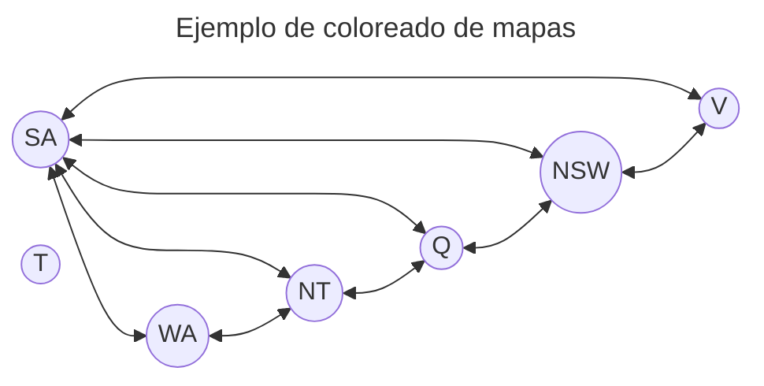

Estructura para la resolución de Problemas de satisfacción de restricciones (CSP)

Ejemplo 1 : coloreado de mapas

- Se definen las Variables  con los nombres de cada region que quiere colorearse

- Se definen los Valores como los colores que pueden asignarse a cada región

- Se definen las restricciones para que cada region que tiene frontera con otra no se pinten del mismo color. Se puede definir la restricción de que una región tenga que ser de un color específico (dominio de valores de un solo elemento) 

