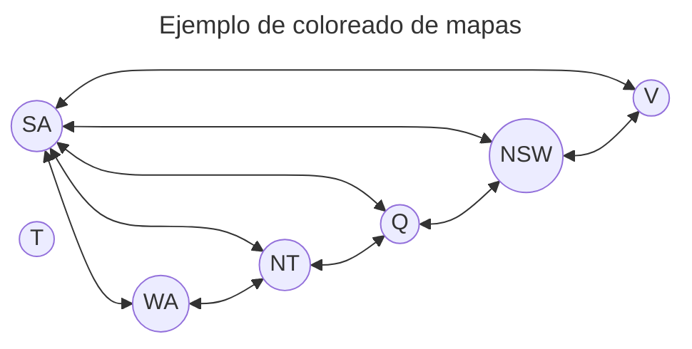

# Estructura para la resolución de Problemas de satisfacción de restricciones (CSP)

Librería robusta y optimizada en Dart para modelar y resolver problemas CSP.

## Características principales

- **Abstracción Genérica**: Soporte para variables (`CspVariable<T>`) y valores (`CspValue<T>`) de cualquier tipo.
- **Restricciones Predefinidas**: Incluye restricciones binarias como `NotEqualConstraint`, `EqualConstraint`, y restricciones numéricas/strings (`NumberLessThanConstraint`, `StringGreaterThanConstraint`, etc.).
- **Núcleo Optimizado**:
  - Uso de constructores `const` para eficiencia de memoria.
  - Gestión de dominios mediante programación funcional.
  - Tipado fuerte y seguridad contra nulos (Null Safety).

## Ejemplo 1: Coloreado de Mapas

- **Variables**: Regiones geográficas.
- **Valores**: Colores disponibles.
- **Restricciones**: Las regiones con frontera común no pueden tener el mismo color (`NotEqualConstraint`).


```mermaid
---
title: Ejemplo de coloreado de mapas
---
flowchart LR  
    SA((SA))
    WA((WA))
    NT((NT))
    Q((Q))
    NSW((NSW))
    V((V))
    T((T))
    SA <--> WA
    SA <--> NT
    SA <--> Q
    SA <--> NSW
    SA <--> V
    WA <--> NT
    NT <--> Q
    Q <--> NSW
    NSW <--> V
```

## Ejemplo 2: Ordenación de tareas en el tiempo y recursos

- **Variables**: Tareas a gestionar.
- **Valores**: Estructuras con inicio y fin (fecha/hora) y recursos asignados.
- **Dominios**: Rango de horas y recursos permitidos para cada tarea.
- **Restricciones**:
  - Precedencia: Una tarea comienza después de que termine la anterior.
  - Solapamiento: Ninguna tarea puede coincidir en tiempo y recurso con otra.

## Uso Básico

```dart
// Definición de variables
var wa = CspVariable(model: "WA");
var nt = CspVariable(model: "NT");

// Definición de dominio
var colors = CspDomain(values: [
  CspValue(model: "Red"),
  CspValue(model: "Green"),
  CspValue(model: "Blue")
]);

// Creación del problema
var csp = Csp<CspVariable, CspValue>();
csp.addVariable(wa);
csp.addVariable(nt);
csp.setDomain(wa, colors);
csp.setDomain(nt, colors);

// Añadir restricciones
csp.addConstraint(NotEqualConstraint(wa, nt));
```
